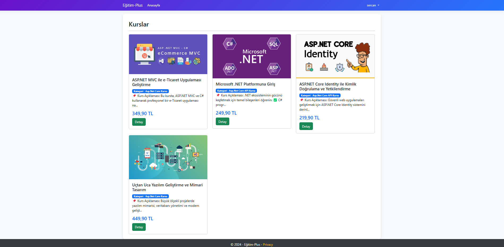
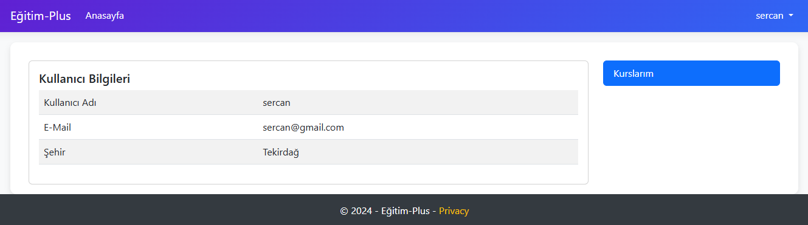
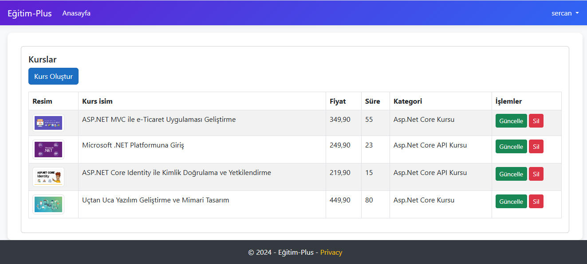
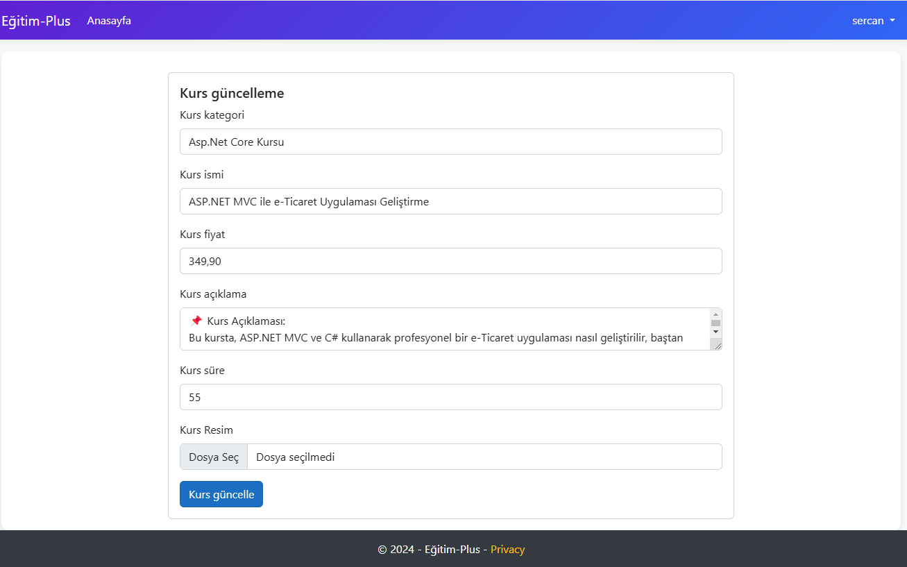
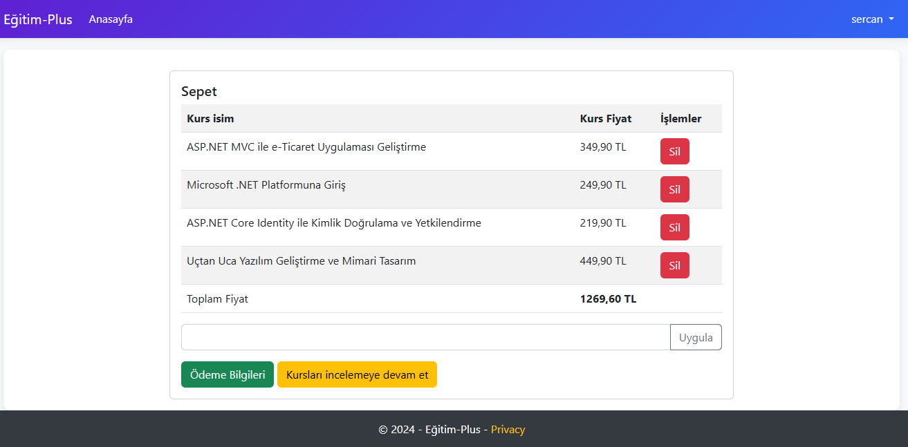
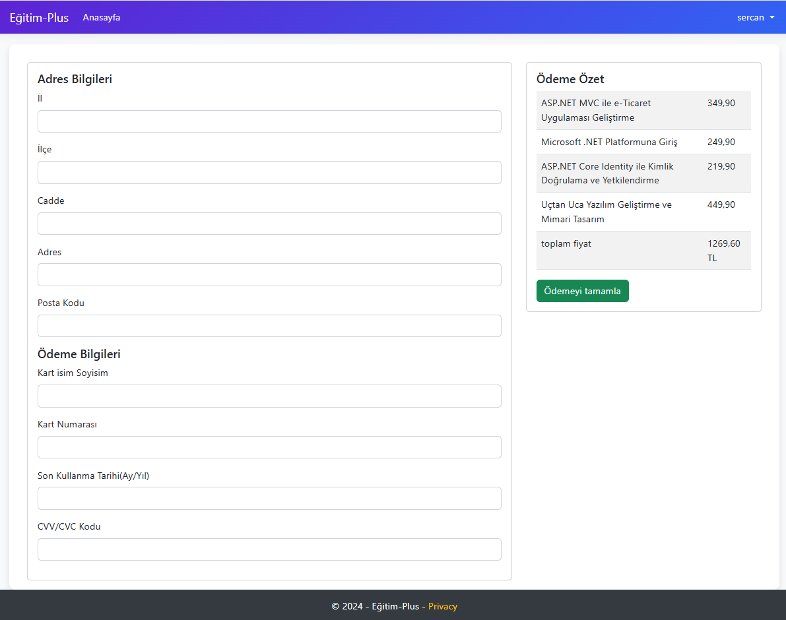

# 🎓 Eğitim Plus - Microservices Projesi  

Bu proje, **.NET 5 ile Microservices** kursunda oluşturduğumuz **Microservice Mimarisi** üzerine inşa edilmiştir.  
Aşağıda projemizin temel mimarisi ve sayfa ekran görüntülerini bulabilirsiniz.  

---

## 📌 Microservice Mimari Yapısı  

🔹 Aşağıda microservice projemizin mimari yapısını gösteren genel bir şema bulunmaktadır:  

  

---

## 🏠 **Anasayfa**  

Anasayfanın modern ve kullanıcı dostu arayüzü:  

  

---

## 👤 **Kullanıcı Bilgileri Sayfası**  

Kullanıcıların profil bilgilerini görüntüleyebildiği ekran:  

  

---

## 📚 **Kurslar Sayfası**  

Mevcut kursları listeleyen ekran görüntüsü:  

  

---

## ✏️ **Kurs Güncelleme Sayfası**  

Kullanıcıların kurs bilgilerini güncelleyebildiği sayfa:  

  

---

## 🛒 **Satın Alma (Sepet) Sayfası**  

Kullanıcıların satın alma işlemlerini gerçekleştirdiği ekran:  

  

---

## 📦 **Sipariş Sayfası**  

Sipariş detaylarının görüntülendiği ve takip edilebildiği sayfa:  

  

---

## 🚀 **Projeyi Çalıştırma**  

### 1️⃣ **Gereksinimler**  
   - .NET 5 SDK  
   - MSSQL veya PostgreSQL  
   - Redis (Opsiyonel)  
   - Visual Studio veya VS Code  

### 2️⃣ **Kurulum Adımları**  
   ```sh
   git clone https://github.com/kullanici/microservices-project.git
   cd microservices-project
